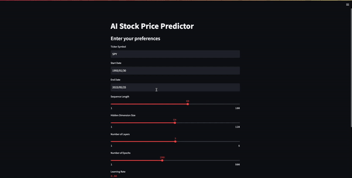

# AI Stock Price Predictor


This is a Streamlit web app which uses a LSTM model to predict future stock prices. The LSTM model is trained on historical stock prices and multiple technical indicators such as Bollinger Bands, MACD, and RSI.

The stock data is fetched from Yahoo Finance using the `yfinance` library. The technical indicators are computed using the `ta` library.

## Features

- Select any publicly traded company from Yahoo Finance.
- Choose the date range of the historical data for the model to train on.
- Set the model hyperparameters such as the sequence length, hidden dimension size, number of layers, number of epochs, and learning rate.
- Visualize the loss during the model training.

## Setup & Installation

1. Clone the repository
```bash
git clone https://github.com/netl1fe/AI-Stock-Price-Predictor.git
```
2. Change directory to the project
```bash
cd AI-Stock-Price-Predictor
```
3. Install the necessary dependencies
```bash
pip install -r requirements.txt
```
4. Run the Streamlit app
```bash
streamlit run app.py
```

## Requirements

The necessary dependencies are listed in the `requirements.txt` file. They include:
- numpy==1.21.0
- pandas==1.3.0
- yfinance==0.1.63
- ta==0.7.0
- scikit-learn==0.24.2
- torch==1.9.0
- streamlit==0.86.0

Please ensure you have the correct versions of these libraries installed to avoid any potential issues.

**Note:** This project assumes you have Python 3.x installed. 

## Usage

- Enter the ticker symbol of the stock you want to predict in the text box.
- Select the date range of the historical data you want to train the model on.
- Use the sliders to set the model hyperparameters.
- Click on "Predict" to start the model training and prediction process.

The predicted stock prices for the next day will be displayed once the model finishes training.

## Disclaimer

This application is for informational purposes only and does not constitute investment advice. Please do your own research before making any investment decisions.
